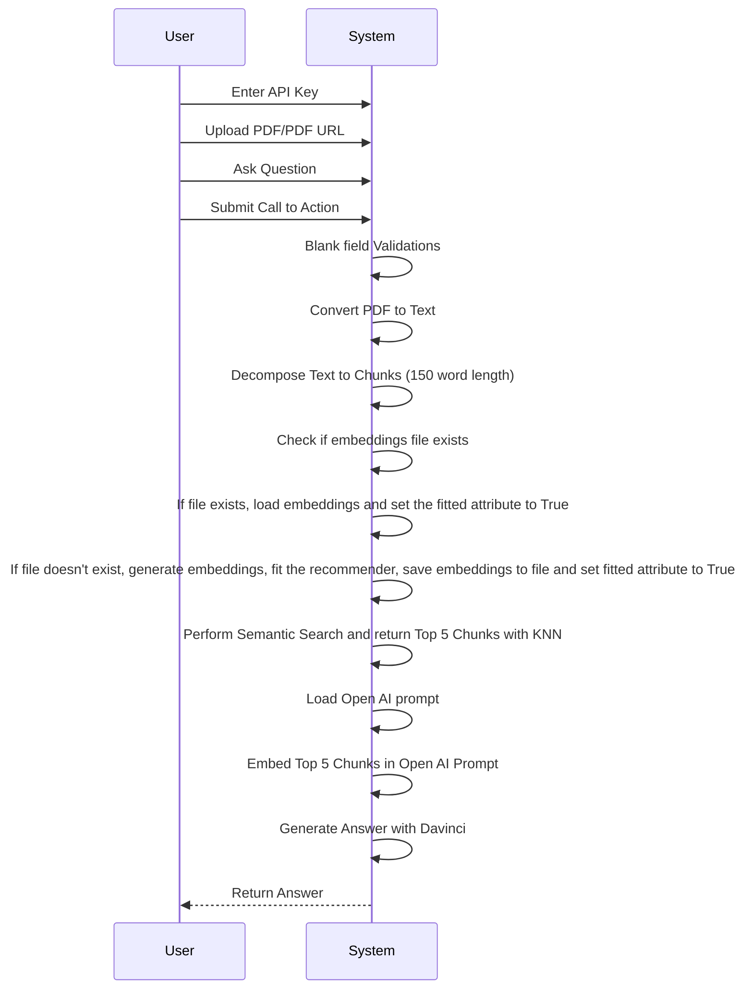
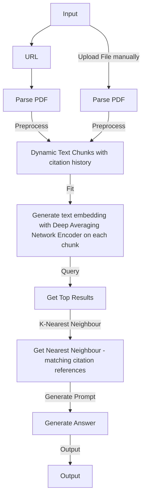

<h2 align="left">Hi 👋! Mohd Ashfaq here, a Data Scientist passionate about transforming data into impactful solutions. I've pioneered Gesture Recognition for seamless human-computer interaction and crafted Recommendation Systems for social media platforms. Committed to building products that contribute to societal welfare. Let's innovate with data! 


</h2>

###


###

<div align="left">
  
  
  
  
  
  
  
  
  
  
  
  
  
</div>

###

<div align="left">
  <a href="[Your YouTube Link]">
    
  </a>
  <a href="[Your Instagram Link]">
    
  </a>
  <a href="[Your Twitch Link]">
    
  </a>
  <a href="[Your Discord Link]">
    
  </a>
  <a href="[Your Gmail Link]">
    
  </a>
  <a href="[Your LinkedIn Link]">
    
  </a>
</div>

###


<br clear="both">


The application follows these steps to provide responses to your questions:

1. PDF Loading: The app reads multiple PDF documents and extracts their text content.

2. Text Chunking: The extracted text is divided into smaller chunks that can be processed effectively.

3. Language Model: The application utilizes a language model to generate vector representations (embeddings) of the text chunks.

4. Similarity Matching: When you ask a question, the app compares it with the text chunks and identifies the most semantically similar ones.

5. Response Generation: The selected chunks are passed to the language model, which generates a response based on the relevant content of the PDFs.

## Dependencies and Installation
----------------------------
To install the MultiPDF Chat App, please follow these steps:

1. Clone the repository to your local machine.

2. Install the required dependencies by running the following command:
   ```
   pip install -r requirements.txt
   ```

3. Obtain an API key from Huggingface and add it to the `.env` file in the project directory.
```commandline
huggingface_api_token=your_secrit_api_key
```


## UML


### Flowchart



