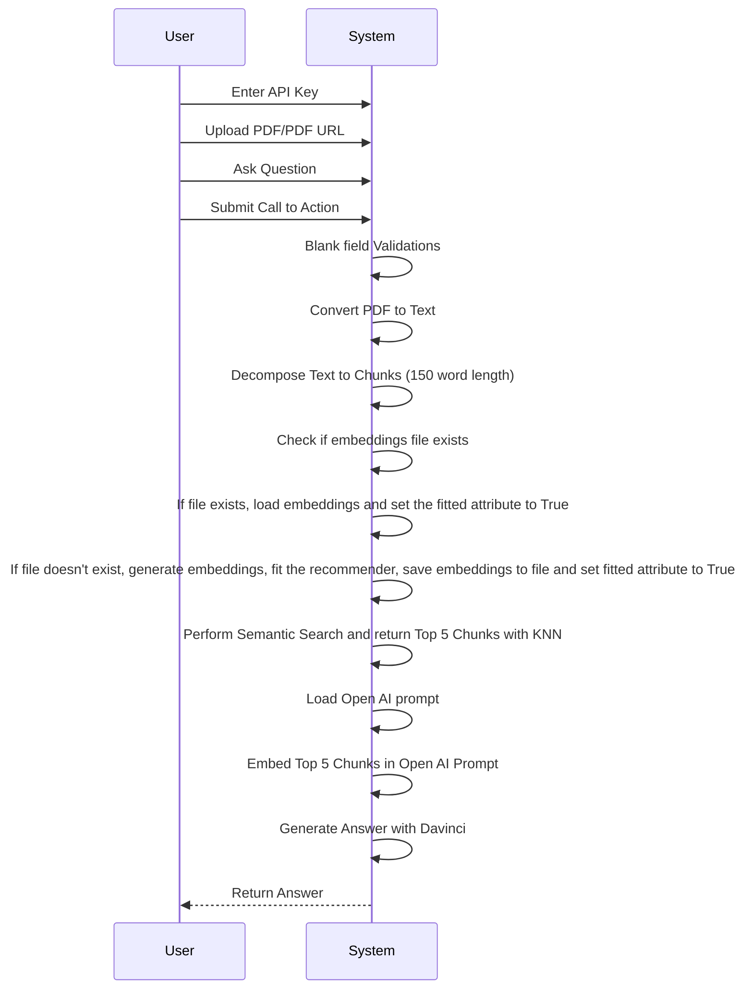
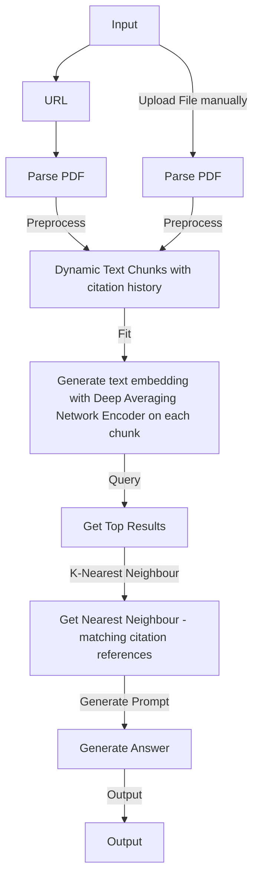

<h2 align="left">Hi 👋! Mohd Ashfaq here, a Data Scientist passionate about transforming data into impactful solutions. I've pioneered Gesture Recognition for seamless human-computer interaction and crafted Recommendation Systems for social media platforms. Committed to building products that contribute to societal welfare. Let's innovate with data! 


</h2>

###


###

<div align="left">
  
  
  
  
  
  
  
  
  
  
  
  
  
</div>

###

<div align="left">
  <a href="[Your YouTube Link]">
    
  </a>
  <a href="[Your Instagram Link]">
    
  </a>
  <a href="[Your Twitch Link]">
    
  </a>
  <a href="[Your Discord Link]">
    
  </a>
  <a href="[Your Gmail Link]">
    
  </a>
  <a href="[Your LinkedIn Link]">
    
  </a>
</div>

###


<br clear="both">


# MultiPDF Chat App


## Introduction
------------
The MultiPDF Chat App is a Python application that allows you to chat with multiple PDF documents. You can ask questions about the PDFs using natural language, and the application will provide relevant responses based on the content of the documents. This app utilizes a language model to generate accurate answers to your queries. Please note that the app will only respond to questions related to the loaded PDFs.

## How It Works
------------


The application follows these steps to provide responses to your questions:

1. PDF Loading: The app reads multiple PDF documents and extracts their text content.

2. Text Chunking: The extracted text is divided into smaller chunks that can be processed effectively.

3. Language Model: The application utilizes a language model to generate vector representations (embeddings) of the text chunks.

4. Similarity Matching: When you ask a question, the app compares it with the text chunks and identifies the most semantically similar ones.

5. Response Generation: The selected chunks are passed to the language model, which generates a response based on the relevant content of the PDFs.

## Dependencies and Installation
----------------------------
To install the MultiPDF Chat App, please follow these steps:

1. Clone the repository to your local machine.

2. Install the required dependencies by running the following command:
   ```
   pip install -r requirements.txt
   ```

3. Obtain an API key from OpenAI and add it to the `.env` file in the project directory.
```commandline
OPENAI_API_KEY=your_secrit_api_key
```

## Usage
-----
To use the MultiPDF Chat App, follow these steps:

1. Ensure that you have installed the required dependencies and added the OpenAI API key to the `.env` file.

2. Run the `main.py` file using the Streamlit CLI. Execute the following command:
   ```
   streamlit run app.py
   ```

3. The application will launch in your default web browser, displaying the user interface.

4. Load multiple PDF documents into the app by following the provided instructions.

5. Ask questions in natural language about the loaded PDFs using the chat interface.

## Contributing
------------
This repository is intended for educational purposes and does not accept further contributions. It serves as supporting material for a YouTube tutorial that demonstrates how to build this project. Feel free to utilize and enhance the app based on your own requirements.

## License
-------
The MultiPDF Chat App is released under the [MIT License](https://opensource.org/licenses/MIT).


demo=https://bit.ly/3SYC9RI


# pdfGPT
## Demo
1. **Demo URL**: https://bhaskartripathi-pdfgpt-turbo.hf.space
2. **Demo Video**:
   
   [](https://www.youtube.com/watch?v=LzPgmmqpBk8)
#### Version Updates (27 July, 2023):
1. Improved error handling
2. PDF GPT now supports Turbo models and GPT4 including 16K and 32K token model.
3. Pre-defined questions for auto-filling the input.
4. Implemented Chat History feature.


### Note on model performance
```If you find the response for a specific question in the PDF is not good using Turbo models, then you need to understand that Turbo models such as gpt-3.5-turbo are chat completion models and will not give a good response in some cases where the embedding similarity is low. Despite the claim by OpenAI, the turbo model is not the best model for Q&A. In those specific cases, either use the good old text-DaVinci-003 or use GPT4 and above. These models invariably give you the most relevant output.```

# Upcoming Release Pipeline:
1. Support for Falcon, Vicuna, Meta Llama
2. OCR Support
3. Multiple PDF file support
4. OCR Support
5. Node.Js based Web Application - With no trial, no API fees. 100% Open source.
    
### Problem Description : 
1. When you pass a large text to Open AI, it suffers from a 4K token limit. It cannot take an entire pdf file as an input
2. Open AI sometimes becomes overtly chatty and returns irrelevant response not directly related to your query. This is because Open AI uses poor embeddings.
3. ChatGPT cannot directly talk to external data. Some solutions use Langchain but it is token hungry if not implemented correctly.
4. There are a number of solutions like https://www.chatpdf.com, https://www.bespacific.com/chat-with-any-pdf, https://www.filechat.io they have poor content quality and are prone to hallucination problem. One good way to avoid hallucinations and improve truthfulness is to use improved embeddings. To solve this problem, I propose to improve embeddings with Universal Sentence Encoder family of algorithms (Read more here: https://tfhub.dev/google/collections/universal-sentence-encoder/1). 

### Solution: What is PDF GPT ?
1. PDF GPT allows you to chat with an uploaded PDF file using GPT functionalities.
2. The application intelligently breaks the document into smaller chunks and employs a powerful Deep Averaging Network Encoder to generate embeddings.
3. A semantic search is first performed on your pdf content and the most relevant embeddings are passed to the Open AI.
4. A custom logic generates precise responses. The returned response can even cite the page number in square brackets([]) where the information is located, adding credibility to the responses and helping to locate pertinent information quickly. The Responses are much better than the naive responses by Open AI.
5. Andrej Karpathy mentioned in this post that KNN algorithm is most appropriate for similar problems: https://twitter.com/karpathy/status/1647025230546886658
6. Enables APIs on Production using **[langchain-serve](https://github.com/jina-ai/langchain-serve)**.

### Docker
Run `docker-compose -f docker-compose.yaml up` to use it with Docker compose.


## Use `pdfGPT` on Production using [langchain-serve](https://github.com/jina-ai/langchain-serve)

#### Local playground
1. Run `lc-serve deploy local api` on one terminal to expose the app as API using langchain-serve.
2. Run `python app.py` on another terminal for a local gradio playground.
3. Open `http://localhost:7860` on your browser and interact with the app.


#### Cloud deployment

Make `pdfGPT` production ready by deploying it on [Jina Cloud](https://cloud.jina.ai/).

`lc-serve deploy jcloud api` 

<details>
<summary>Show command output</summary>

```text
╭──────────────┬──────────────────────────────────────────────────────────────────────────────────────╮
│ App ID       │                                 langchain-3ff4ab2c9d                                 │
├──────────────┼──────────────────────────────────────────────────────────────────────────────────────┤
│ Phase        │                                       Serving                                        │
├──────────────┼──────────────────────────────────────────────────────────────────────────────────────┤
│ Endpoint     │                      https://langchain-3ff4ab2c9d.wolf.jina.ai                       │
├──────────────┼──────────────────────────────────────────────────────────────────────────────────────┤
│ App logs     │                               dashboards.wolf.jina.ai                                │
├──────────────┼──────────────────────────────────────────────────────────────────────────────────────┤
│ Swagger UI   │                    https://langchain-3ff4ab2c9d.wolf.jina.ai/docs                    │
├──────────────┼──────────────────────────────────────────────────────────────────────────────────────┤
│ OpenAPI JSON │                https://langchain-3ff4ab2c9d.wolf.jina.ai/openapi.json                │
╰──────────────┴──────────────────────────────────────────────────────────────────────────────────────╯
```

</details>

#### Interact using cURL

(Change the URL to your own endpoint)

**PDF url**
```bash
curl -X 'POST' \
  'https://langchain-3ff4ab2c9d.wolf.jina.ai/ask_url' \
  -H 'accept: application/json' \
  -H 'Content-Type: application/json' \
  -d '{
  "url": "https://uiic.co.in/sites/default/files/uploads/downloadcenter/Arogya%20Sanjeevani%20Policy%20CIS_2.pdf",
  "question": "What'\''s the cap on room rent?",
  "envs": {
    "OPENAI_API_KEY": "'"${OPENAI_API_KEY}"'"
    }
}'

{"result":" Room rent is subject to a maximum of INR 5,000 per day as specified in the Arogya Sanjeevani Policy [Page no. 1].","error":"","stdout":""}
```

**PDF file**
```bash
QPARAMS=$(echo -n 'input_data='$(echo -n '{"question": "What'\''s the cap on room rent?", "envs": {"OPENAI_API_KEY": "'"${OPENAI_API_KEY}"'"}}' | jq -s -R -r @uri))
curl -X 'POST' \
  'https://langchain-3ff4ab2c9d.wolf.jina.ai/ask_file?'"${QPARAMS}" \
  -H 'accept: application/json' \
  -H 'Content-Type: multipart/form-data' \
  -F 'file=@Arogya_Sanjeevani_Policy_CIS_2.pdf;type=application/pdf'

{"result":" Room rent is subject to a maximum of INR 5,000 per day as specified in the Arogya Sanjeevani Policy [Page no. 1].","error":"","stdout":""}
```

## Running on localhost
### Credits : [Adithya S](https://github.com/200901002)
1. Pull the image by entering the following command in your terminal or command prompt:
```bash
docker pull registry.hf.space/bhaskartripathi-pdfchatter:latest
```
2. Download the Universal Sentence Encoder locally to your project's root folder. This is important because otherwise, 915 MB will be downloaded at runtime everytime you run it.
3. Download the encoder using this [link](https://tfhub.dev/google/universal-sentence-encoder/4?tf-hub-format=compressed).
4. Extract the downloaded file and place it in your project's root folder as shown below:
```text
Root folder of your project
└───Universal Sentence Encoder
|   ├───assets
|   └───variables
|   └───saved_model.pb
|
└───app.py
```
5. If you have downloaded it locally, replace the code on line 68 in the API file:
```python
self.use = hub.load('https://tfhub.dev/google/universal-sentence-encoder/4')
```
with:
```python
self.use = hub.load('./Universal Sentence Encoder/')
```
6. Now, To run PDF-GPT, enter the following command:

```bash
docker run -it -p 7860:7860 --platform=linux/amd64 registry.hf.space/bhaskartripathi-pdfchatter:latest python app.py
```
### **Original Source code with no integrations** (for demo hosted in Hugging Face) : 
https://huggingface.co/spaces/bhaskartripathi/pdfGPT_Turbo


## UML


### Flowchart



